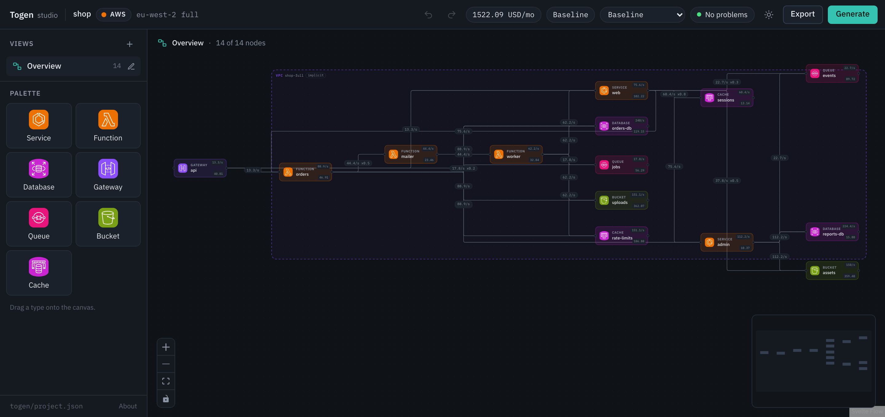
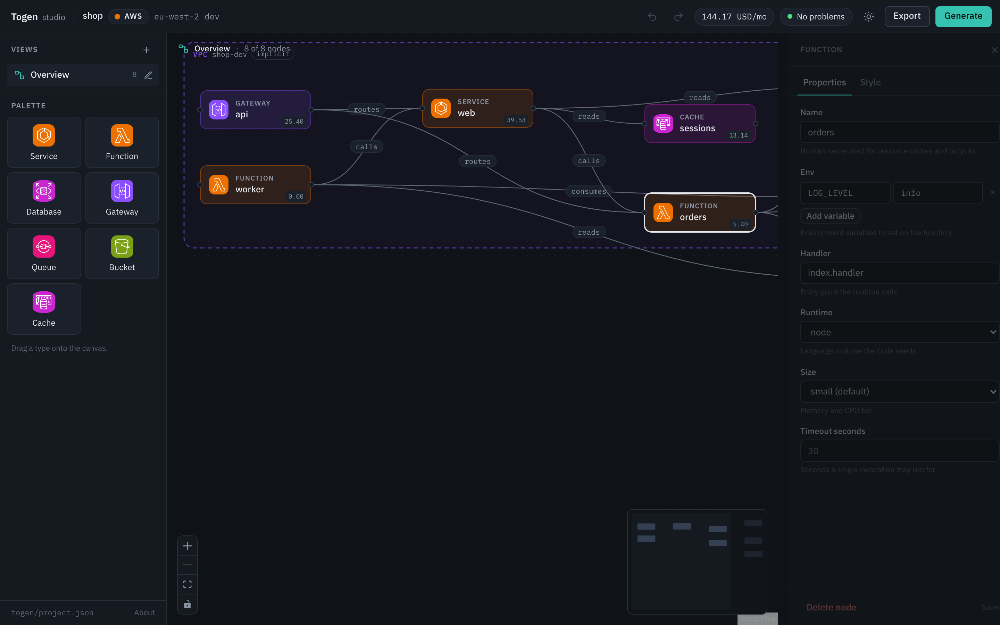

# Togen

Sketch a system as boxes and edges, get a starting infrastructure repository.
Local, deterministic, no account needed.

[](https://github.com/mooncitizen/togen/actions/workflows/ci.yml)
[](https://github.com/mooncitizen/togen/releases)
[](LICENSE)
[](https://mooncitizen.github.io/togen)

[](https://mooncitizen.github.io/togen)

## What it does

You draw the system: a gateway in front of some functions, a database, a
queue, a bucket. Togen resolves that into a provider's idea of the same
system and writes plain Terraform into your repository. There is no runtime
and nothing to keep installed; delete Togen and the code still works.

It runs on your machine: no account, no sign-in, no network call when it
generates, including the cost estimate, which is priced from a snapshot
bundled in the binary. AWS, Google Cloud and Azure. Seven node types.
Terraform HCL.

## Install

Download a binary from
[releases](https://github.com/mooncitizen/togen/releases):

```bash
curl -fsSL https://github.com/mooncitizen/togen/releases/latest/download/togen_$(uname -s | tr A-Z a-z)_$(uname -m | sed s/x86_64/amd64/).tar.gz | tar xz togen
sudo install -m 0755 togen /usr/local/bin/togen
togen --version
```

Or with Go, if you only want the CLI:

```bash
go install github.com/mooncitizen/togen/cmd/togen@latest
```

`go install` cannot embed the studio's canvas, since `internal/server/dist/`
is built by pnpm and not checked in: `togen studio` from that build serves a
placeholder listing the API instead. Use a release binary for the studio.

Or from source, which needs [nix](https://nixos.org):

```bash
git clone https://github.com/mooncitizen/togen.git
cd togen
nix develop -c just build
```

## Sixty seconds

```bash
mkdir demo && cd demo
togen init --name demo --provider aws
togen studio
```

The studio opens on an empty canvas. Drag a gateway and a function out of the
palette, drag from the right of the gateway to the left of the function to
route between them, then press Generate.

```bash
cd infra/hcl
terraform init -backend=false && terraform validate
```

`terraform plan` additionally wants each function's deployment package on
disk at `functions/<name>.zip`. The path is a variable, so point it wherever
your build puts it.

Slower version: [quickstart](https://mooncitizen.github.io/togen/getting-started/quickstart/).

## What it generates

```hcl
# Generated by Togen - https://github.com/mooncitizen/togen

# network

data "aws_availability_zones" "available" {
  state = "available"
}

resource "aws_vpc" "main" {
  cidr_block           = "10.0.0.0/16"
  enable_dns_support   = true
  enable_dns_hostnames = true

  tags = {
    Name = "shop-dev-vpc"
  }
}
```

The start of `examples/aws-basic`'s `infra/hcl/main.tf`, generated by the
binary this README was written against. The rest is ordinary Terraform.

## The studio



Click a node to set its name and properties, in a form built from the schema
so it always matches what the resolver understands. Drag between two nodes to
connect them: a pairing the relation table has no meaning for is refused,
with the reason. Views let you show a slice of a large project, and Export
renders the open view to a PNG or a JPEG.

More at [the studio](https://mooncitizen.github.io/togen/guides/the-studio/).

## Simulation

A sketch is a shape, not a load. `togen simulate` and the studio's canvas take
a description of traffic, sources injecting requests, an optional burst for a
launch or a sale, and the fan-out on edges that are not one call in for one
call out, and turn it into a rate for every node and edge. It lives at
`togen/simulation.json`, which the studio writes as you edit traffic on the
canvas: a scenario selector for baseline and each burst, and animated
particles showing which paths carry the load.

With a simulation present, `togen cost` prices usage from the rates it works
out, though anything set by hand in `togen.yml`'s `usage` block still wins
field by field.

## What it will cost

```bash
togen cost
```

```
api        gateway       HTTP API
  requests        21900000 requests  x    0.00000116 USD    25.40
                                                            25.40
orders-db  database      db.t4g.micro, postgres 17, single-AZ, 20 GB
  instance             730 h         x        0.0180 USD    13.14
  storage gp2           20 GB        x        0.1330 USD     2.66
                                                            15.80
...
not priced
  api        gateway       data transfer
  network    implicit VPC  nat gateway data
  ...

total  144.17 USD/month  eu-west-2, list prices from 2026-09-06, estimate not a quote
```

That is `examples/aws-basic`, trimmed. The figures come from a price snapshot
bundled in the binary, so it works offline. A meter that cannot be sized is
listed under `not priced` rather than counted as free, and the last line
names the snapshot. It is an estimate, never a quote.

## Status

Milestone one. AWS, Google Cloud and Azure resolvers, Terraform HCL output,
seven node types: gateway, function, service, database, queue, bucket, cache.

`togen cost` bundles real prices for AWS and Azure. Google Cloud is not
priced yet: every node returns `no gcp prices are bundled yet` and totals
`0.00 USD/month`.

`targets` in `togen.yml` documents `hcl`, `pulumi` and `cdktf`, but only `hcl`
is implemented; the other two fail rather than silently falling back.
Terraform import, bringing existing cloud resources into a Togen sketch, is
drawn on the studio's first-run screen and badged "coming later", but is not
built. The [roadmap](https://mooncitizen.github.io/togen/about/roadmap/) is
honest about the rest.

## Documentation

[mooncitizen.github.io/togen](https://mooncitizen.github.io/togen) has
guides for [configuration](https://mooncitizen.github.io/togen/guides/configuration/),
[providers](https://mooncitizen.github.io/togen/guides/providers/) and
[views](https://mooncitizen.github.io/togen/guides/views/); reference for the
[CLI](https://mooncitizen.github.io/togen/reference/cli/), the
[project files](https://mooncitizen.github.io/togen/reference/project-files/)
and the [node catalogue](https://mooncitizen.github.io/togen/reference/catalogue/);
and [why Togen](https://mooncitizen.github.io/togen/about/why-togen/) exists.

## Contributing

[CONTRIBUTING.md](CONTRIBUTING.md). Issues and pull requests welcome.

## Licence

[Apache-2.0](LICENSE). Free to use, commercially included.

Every file Togen generates opens with a line naming the project. Leaving it
in place is the only credit asked for.
